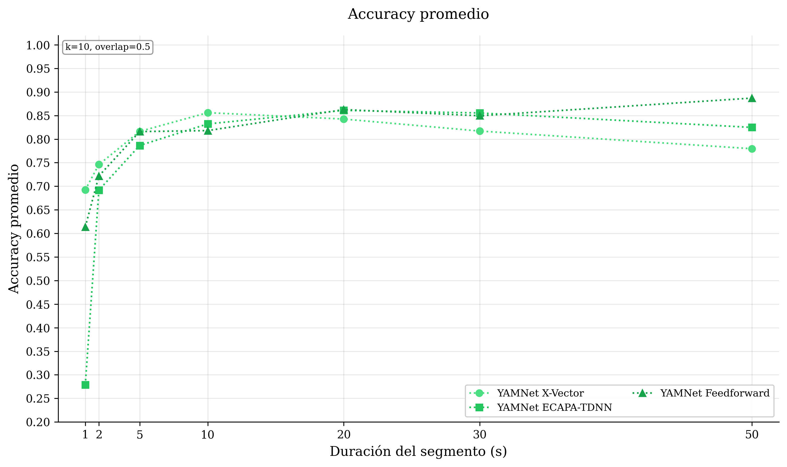
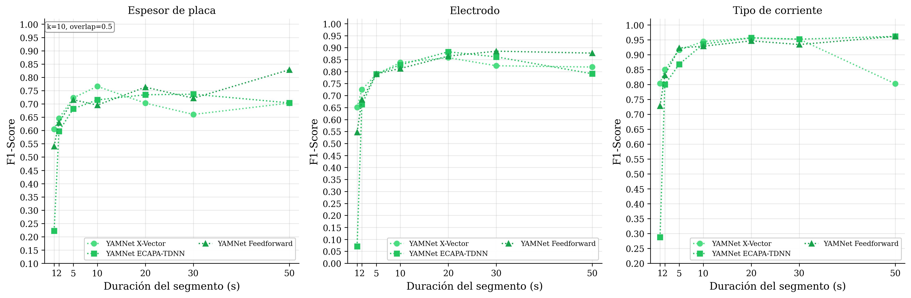
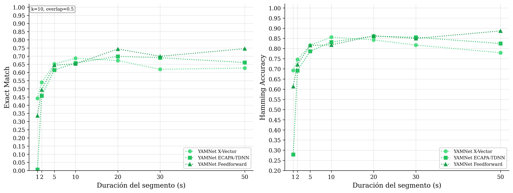
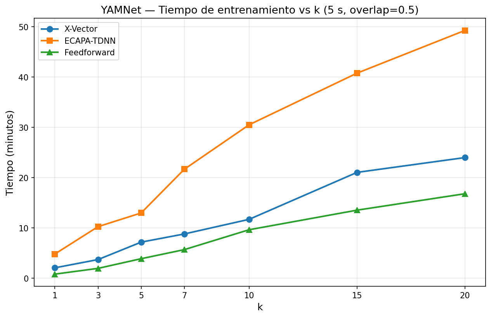

# YAMNet — Resultados (Blind Set)

**Backbone:** YAMNet (embeddings pre-entrenados)  
**Configuración:** k-fold = 10, overlap = 0.5  
**Datos:** `inferencia.json` (conjunto ciego)

---

## Mejor Modelo (5 s): X-Vector

| Métrica            |    Valor    |
| ------------------ | :---------: |
| Exact Match        | **65.19 %** |
| Hamming Accuracy   | **81.63 %** |
| Plate Accuracy     |   71.82 %   |
| Electrode Accuracy |   80.97 %   |
| Current Accuracy   |   92.11 %   |

---

## Comparación de Arquitecturas (5 s)

| Modelo       | Plate Acc | Electrode Acc | Current Acc | Exact Match | Hamming Acc |
| ------------ | :-------: | :-----------: | :---------: | :---------: | :---------: |
| **X-Vector** |  71.82 %  |    80.97 %    |   92.11 %   | **65.19 %** | **81.63 %** |
| ECAPA-TDNN   |  67.61 %  |    81.07 %    |   87.28 %   |   61.51 %   |   78.65 %   |
| Feedforward  |  70.87 %  |    81.18 %    |   92.74 %   |   64.46 %   |   81.60 %   |

---

## Resultados por Duración

### X-Vector

| Duración | Plate Acc | Electrode Acc | Current Acc | Exact Match | Hamming Acc |
| :------: | :-------: | :-----------: | :---------: | :---------: | :---------: |
|   1 s    |  60.06 %  |    66.76 %    |   80.93 %   |   44.21 %   |   69.25 %   |
|   2 s    |  63.94 %  |    74.24 %    |   85.64 %   |   54.00 %   |   74.60 %   |
|   5 s    |  71.82 %  |    80.97 %    |   92.11 %   |   65.19 %   |   81.63 %   |
|   10 s   |  76.06 %  |    85.91 %    |   94.85 %   |   68.68 %   |   85.61 %   |
|   20 s   |  69.35 %  |    87.44 %    |   95.98 %   |   67.34 %   |   84.25 %   |
|   30 s   |  65.49 %  |    84.07 %    |   95.58 %   |   61.95 %   |   81.71 %   |
|   50 s   |  69.49 %  |    83.05 %    |   81.36 %   |   62.71 %   |   77.97 %   |

### ECAPA-TDNN

| Duración | Plate Acc | Electrode Acc | Current Acc | Exact Match | Hamming Acc |
| :------: | :-------: | :-----------: | :---------: | :---------: | :---------: |
|   1 s    |  36.21 %  |    12.99 %    |   34.42 %   |   0.54 %    |   27.87 %   |
|   2 s    |  58.99 %  |    68.24 %    |   80.32 %   |   45.72 %   |   69.18 %   |
|   5 s    |  67.61 %  |    81.07 %    |   87.28 %   |   61.51 %   |   78.65 %   |
|   10 s   |  70.92 %  |    84.79 %    |   93.96 %   |   65.77 %   |   83.22 %   |
|   20 s   |  72.86 %  |    89.45 %    |   95.98 %   |   69.85 %   |   86.10 %   |
|   30 s   |  73.45 %  |    87.61 %    |   95.58 %   |   69.03 %   |   85.55 %   |
|   50 s   |  69.49 %  |    81.36 %    |   96.61 %   |   66.10 %   |   82.49 %   |

### Feedforward

| Duración | Plate Acc | Electrode Acc | Current Acc | Exact Match | Hamming Acc |
| :------: | :-------: | :-----------: | :---------: | :---------: | :---------: |
|   1 s    |  53.57 %  |    57.64 %    |   72.91 %   |   33.60 %   |   61.37 %   |
|   2 s    |  62.19 %  |    70.71 %    |   83.65 %   |   49.45 %   |   72.18 %   |
|   5 s    |  70.87 %  |    81.18 %    |   92.74 %   |   64.46 %   |   81.60 %   |
|   10 s   |  68.68 %  |    83.45 %    |   93.29 %   |   65.32 %   |   81.80 %   |
|   20 s   |  75.88 %  |    87.94 %    |   94.97 %   |   74.37 %   |   86.26 %   |
|   30 s   |  71.68 %  |    89.38 %    |   93.81 %   |   69.91 %   |   84.96 %   |
|   50 s   |  83.05 %  |    86.44 %    |   96.61 %   |   74.58 %   |   88.70 %   |

---

## Tiempos de Extracción de Características

| Duración | Tiempo (s) | Segmentos |
| :------: | :--------: | :-------: |
|   1 s    |   446.88   |  43 170   |
|   2 s    |   467.12   |  21 313   |
|   5 s    |   438.74   |   8 185   |
|   10 s   |   416.83   |   3 819   |
|   20 s   |   365.20   |   1 640   |
|   30 s   |   306.41   |    918    |
|   50 s   |   235.38   |    448    |

---

## Gráficas

Las siguientes gráficas muestran el rendimiento de evaluación sobre el conjunto ciego usando métricas globales y por tarea según la duración del segmento de audio. El modelo evaluado pertenece únicamente a la arquitectura probada.

### Accuracy por duración

### F1-score por duración

### Métricas globales (Exact Match y Hamming Accuracy)

---

### Tiempos de extracción de características por duración

Tiempo de extracción total y por archivo según duración del segmento:

| Duración | Tiempo total (s) | Segmentos | ms/archivo |
| :------: | :--------------: | :-------: | :--------: |
|   1 s    |      446.88      |  43 170   |   10.35    |
|   2 s    |      467.12      |  21 313   |   21.92    |
|   5 s    |      438.74      |   8 185   |   53.60    |
|   10 s   |      416.83      |   3 819   |   109.15   |
|   20 s   |      365.20      |   1 640   |   222.68   |
|   30 s   |      306.41      |    918    |   333.78   |
|   50 s   |      235.38      |    448    |   525.40   |

### Tiempos de entrenamiento por duración

Tiempo de entrenamiento (k=10, overlap=0.5) por arquitectura según duración del segmento:

| Duración | X-Vector (s) | ECAPA-TDNN (s) | Feedforward (s) | X-Vector (min) | ECAPA-TDNN (min) | Feedforward (min) |
| :------: | :----------: | :------------: | :-------------: | :------------: | :--------------: | :---------------: |
|   1 s    |    2417.5    |     3274.8     |     3091.1      |     40.29      |      54.58       |       51.52       |
|   2 s    |    1282.0    |     1830.3     |     1239.7      |     21.37      |      30.51       |       20.66       |
|   5 s    |    703.8     |     1831.5     |      579.7      |     11.73      |      30.52       |       9.66        |
|   10 s   |    394.3     |     860.3      |      375.8      |      6.57      |      14.34       |       6.26        |
|   20 s   |    352.8     |     516.6      |      248.1      |      5.88      |       8.61       |       4.14        |
|   30 s   |    286.3     |     420.6      |      190.8      |      4.77      |       7.01       |       3.18        |
|   50 s   |    167.1     |     320.5      |      125.7      |      2.79      |       5.34       |       2.10        |

### Tiempos de entrenamiento vs k (5 s, overlap=0.5)

Tiempo de entrenamiento por arquitectura para Study 2 (duración fija 5 s), usando datos de `resultados.json`.

|  k  | X-Vector (s) | ECAPA-TDNN (s) | Feedforward (s) | X-Vector (min) | ECAPA-TDNN (min) | Feedforward (min) |
| :-: | :----------: | :------------: | :-------------: | :------------: | :--------------: | :---------------: |
|  1  |    125.37    |     289.96     |      50.35      |      2.09      |       4.83       |       0.84        |
|  3  |    223.81    |     616.32     |     118.86      |      3.73      |      10.27       |       1.98        |
|  5  |    431.97    |     780.07     |     234.34      |      7.20      |      13.00       |       3.91        |
|  7  |    529.49    |    1301.48     |     342.65      |      8.82      |      21.69       |       5.71        |
| 10  |    703.82    |    1831.66     |     579.74      |     11.73      |      30.53       |       9.66        |
| 15  |   1263.97    |    2447.68     |     813.30      |     21.07      |      40.79       |       13.55       |
| 20  |   1440.59    |    2957.23     |     1009.34     |     24.01      |      49.29       |       16.82       |

### Tiempos de inferencia por archivo (5 s, k=10, overlap=0.5)

Tiempo de inferencia sobre el conjunto ciego en segmentos de 5 s:

| Arquitectura | Tiempo total (s) | s/archivo | ms/archivo |
| ------------ | :--------------: | :-------: | :--------: |
| X-Vector     |      87.19       |   0.092   |   91.68    |
| ECAPA-TDNN   |      95.86       |   0.101   |   100.80   |
| Feedforward  |      77.36       |   0.081   |   81.35    |

