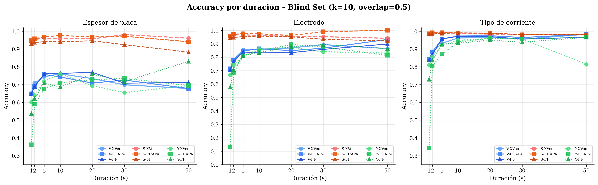
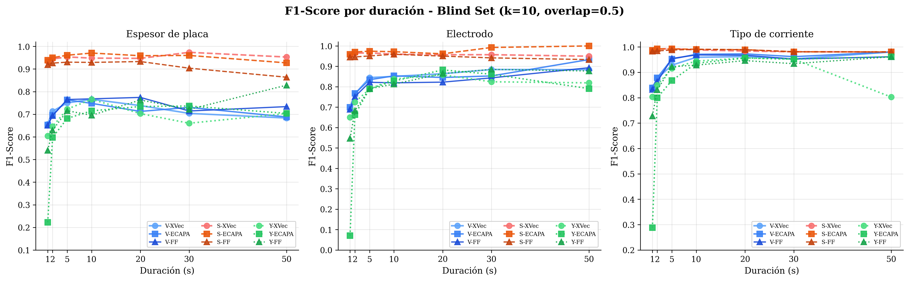
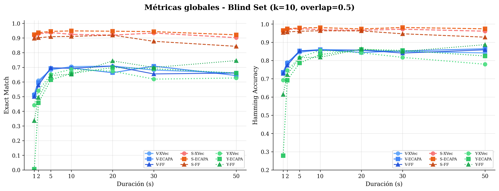
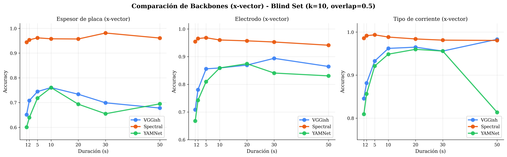
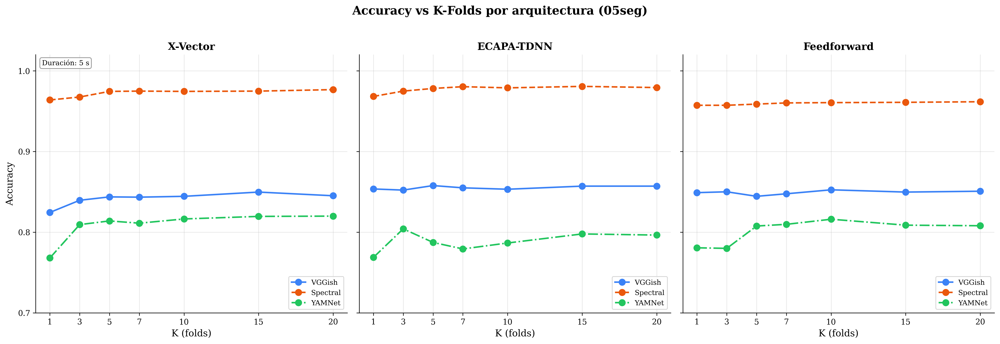
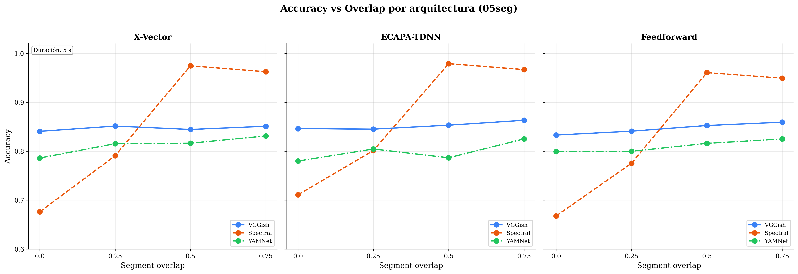
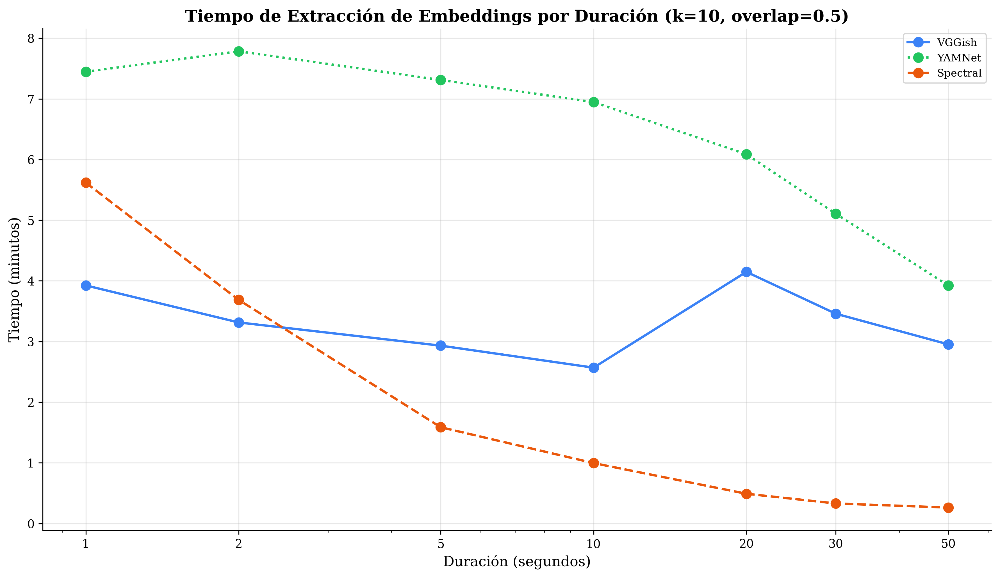
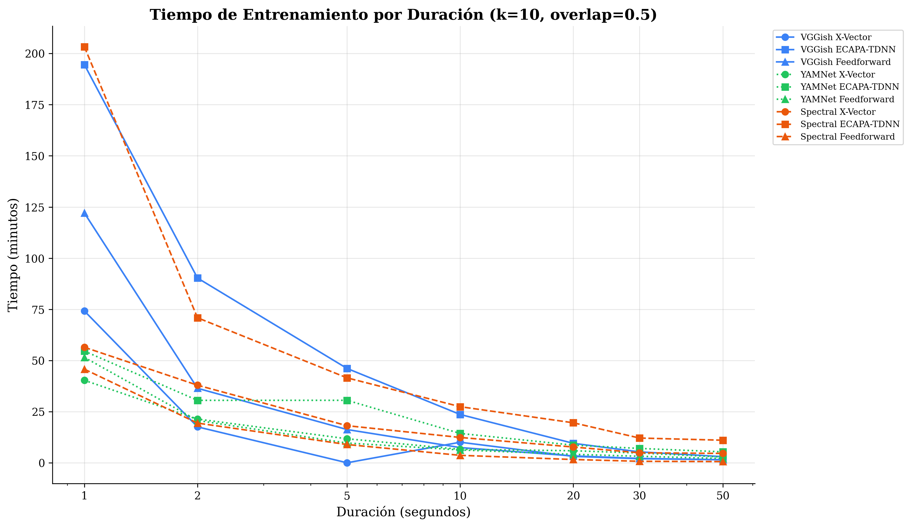
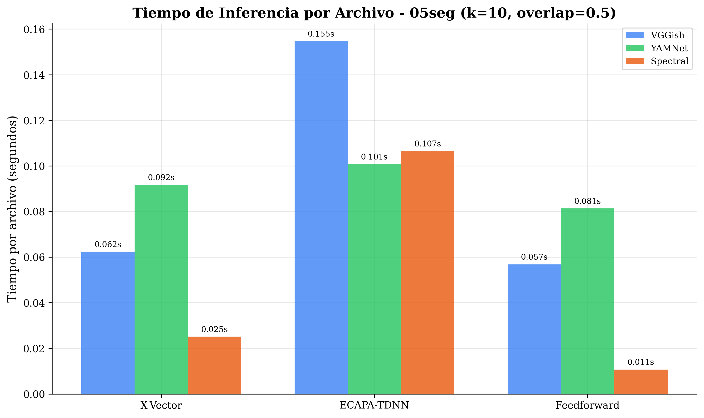

# YAMNet — Resultados (Blind Set)

**Backbone:** YAMNet (embeddings pre-entrenados)  
**Configuración:** k-fold = 10, overlap = 0.5  
**Datos:** `inferencia.json` (conjunto ciego)

---

## Mejor Modelo (5 s): X-Vector

| Métrica            |    Valor    |
| ------------------ | :---------: |
| Exact Match        | **65.19 %** |
| Hamming Accuracy   | **81.63 %** |
| Plate Accuracy     |   71.82 %   |
| Electrode Accuracy |   80.97 %   |
| Current Accuracy   |   92.11 %   |

---

## Comparación de Arquitecturas (5 s)

| Modelo       | Plate Acc | Electrode Acc | Current Acc | Exact Match | Hamming Acc |
| ------------ | :-------: | :-----------: | :---------: | :---------: | :---------: |
| **X-Vector** |  71.82 %  |    80.97 %    |   92.11 %   | **65.19 %** | **81.63 %** |
| ECAPA-TDNN   |  67.61 %  |    81.07 %    |   87.28 %   |   61.51 %   |   78.65 %   |
| Feedforward  |  70.87 %  |    81.18 %    |   92.74 %   |   64.46 %   |   81.60 %   |

---

## Resultados por Duración

### X-Vector

| Duración | Plate Acc | Electrode Acc | Current Acc | Exact Match | Hamming Acc |
| :------: | :-------: | :-----------: | :---------: | :---------: | :---------: |
|   1 s    |  60.06 %  |    66.76 %    |   80.93 %   |   44.21 %   |   69.25 %   |
|   2 s    |  63.94 %  |    74.24 %    |   85.64 %   |   54.00 %   |   74.60 %   |
|   5 s    |  71.82 %  |    80.97 %    |   92.11 %   |   65.19 %   |   81.63 %   |
|   10 s   |  76.06 %  |    85.91 %    |   94.85 %   |   68.68 %   |   85.61 %   |
|   20 s   |  69.35 %  |    87.44 %    |   95.98 %   |   67.34 %   |   84.25 %   |
|   30 s   |  65.49 %  |    84.07 %    |   95.58 %   |   61.95 %   |   81.71 %   |
|   50 s   |  69.49 %  |    83.05 %    |   81.36 %   |   62.71 %   |   77.97 %   |

### ECAPA-TDNN

| Duración | Plate Acc | Electrode Acc | Current Acc | Exact Match | Hamming Acc |
| :------: | :-------: | :-----------: | :---------: | :---------: | :---------: |
|   1 s    |  36.21 %  |    12.99 %    |   34.42 %   |   0.54 %    |   27.87 %   |
|   2 s    |  58.99 %  |    68.24 %    |   80.32 %   |   45.72 %   |   69.18 %   |
|   5 s    |  67.61 %  |    81.07 %    |   87.28 %   |   61.51 %   |   78.65 %   |
|   10 s   |  70.92 %  |    84.79 %    |   93.96 %   |   65.77 %   |   83.22 %   |
|   20 s   |  72.86 %  |    89.45 %    |   95.98 %   |   69.85 %   |   86.10 %   |
|   30 s   |  73.45 %  |    87.61 %    |   95.58 %   |   69.03 %   |   85.55 %   |
|   50 s   |  69.49 %  |    81.36 %    |   96.61 %   |   66.10 %   |   82.49 %   |

### Feedforward

| Duración | Plate Acc | Electrode Acc | Current Acc | Exact Match | Hamming Acc |
| :------: | :-------: | :-----------: | :---------: | :---------: | :---------: |
|   1 s    |  53.57 %  |    57.64 %    |   72.91 %   |   33.60 %   |   61.37 %   |
|   2 s    |  62.19 %  |    70.71 %    |   83.65 %   |   49.45 %   |   72.18 %   |
|   5 s    |  70.87 %  |    81.18 %    |   92.74 %   |   64.46 %   |   81.60 %   |
|   10 s   |  68.68 %  |    83.45 %    |   93.29 %   |   65.32 %   |   81.80 %   |
|   20 s   |  75.88 %  |    87.94 %    |   94.97 %   |   74.37 %   |   86.26 %   |
|   30 s   |  71.68 %  |    89.38 %    |   93.81 %   |   69.91 %   |   84.96 %   |
|   50 s   |  83.05 %  |    86.44 %    |   96.61 %   |   74.58 %   |   88.70 %   |

---

## Tiempos de Extracción de Características

| Duración | Tiempo (s) | Segmentos |
| :------: | :--------: | :-------: |
|   1 s    |   446.88   |  43 170   |
|   2 s    |   467.12   |  21 313   |
|   5 s    |   438.74   |   8 185   |
|   10 s   |   416.83   |   3 819   |
|   20 s   |   365.20   |   1 640   |
|   30 s   |   306.41   |    918    |
|   50 s   |   235.38   |    448    |

---

## Gráficas

### Accuracy por duración

### F1-score por duración

### Métricas globales (Exact Match y Hamming)

### Comparación por backbone

### Comparación por k-folds

### Comparación por overlap

### Tiempos de extracción

### Tiempos de entrenamiento

### Tiempos de inferencia

